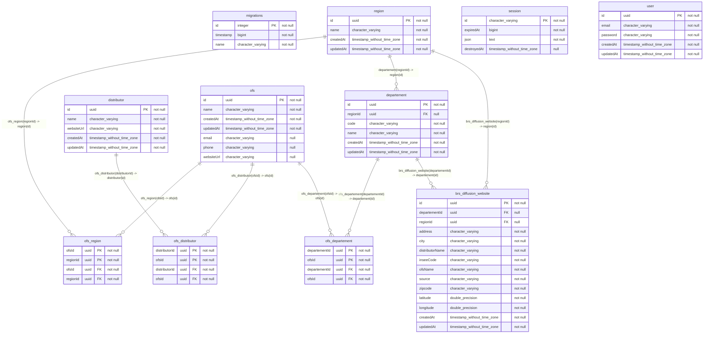

## Diagram

## Indexes

### `brs_diffusion_website`

- `PK_858887ac745bd72e497a206c478`

### `departement`

- `PK_f32f7be16ef46566fececc35a34`

### `distributor`

- `PK_949c7e62bf60d4e6488f6f29b8d`

### `migrations`

- `PK_8c82d7f526340ab734260ea46be`

### `ofs`

- `PK_3a8315363ae9c24cfdd2d6c271f`

### `ofs_departement`

- `IDX_2457693ca31a60129662757580`
- `IDX_700602826f82b6c99dc7c0983c`
- `PK_b05429ff8f65c8198b42bb60cf5`

### `ofs_distributor`

- `IDX_0a00bec739bf153c85214fffb9`
- `IDX_b28fbce6232f17861b1050ae5a`
- `PK_2d2cb6d9c4f8bd733910bd4a779`

### `ofs_region`

- `IDX_224b0edf255c9b5d182a8707d4`
- `IDX_397995bf5d393e1cb85b908060`
- `PK_a646d3a88fab887cce6281a5607`

### `region`

- `PK_5f48ffc3af96bc486f5f3f3a6da`

### `session`

- `IDX_28c5d1d16da7908c97c9bc2f74`
- `PK_f55da76ac1c3ac420f444d2ff11`

### `user`

- `PK_cace4a159ff9f2512dd42373760`
- `UQ_e12875dfb3b1d92d7d7c5377e22`
